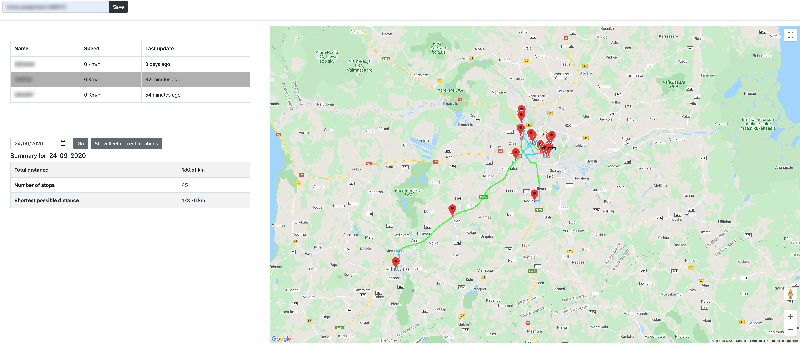

# Fleet Tracker



### Getting started
#### Software requirements
- [Docker](https://www.docker.com "Docker")

#### Running the application locally

Open `FleetTracker/src/app/app.module.ts`

Replace "API_KEY" with your API key from Google Maps API

```
AgmCoreModule.forRoot({
      apiKey: 'API_KEY'
})
```

Create `.env` file in root directory and provide it with the same API key

```
GOOGLE_API_KEY=GOOGLEAPIKEYHERE
```

To start server:
```
docker-compose up -d
```
In browser open:
```
localhost:80
```

### Technical info

Fleet Complete API implementation using Angular.

#### Journey summary

When picking a vehicle from fleet, selecting a date, the map draws a route.
The line changes color, depending on vehicles speed:
```
0-50kmh - Blue
51-90   - Green
Over 90 - Red
```

* Total distance calculated using the data from vehicles odometer.
In case if there is no such information provided, location data is used to calculate total distance using geolib.

* Number of stops calculated by counting intervals where vehicles speed is 0 and taking the first point of it.

#### Additional Express REST API

I didn't find good enough library to use for Google Maps routing service, so I used [this](https://www.npmjs.com/package/@googlemaps/google-maps-services-js "Google maps services") one.
Because this library only works in backend side, I created Node Express REST API.

By developing it, I discovered that Google Maps API only takes start,end points and 25 waypoints. So it took me some time to create a function that splits every request in chunks of 27.

I observed that in some cases the calculated "shortest path" is a bit longer than the actual route.
This can be fixed probably by using the real adresses of places where the vehicle did stop.

Technologies used:

* [Angular](https://angular.io/ "Angular")
    * [NG-Bootstrap](https://ng-bootstrap.github.io/ "NG-Bootstrap")
    * [Geolib](https://www.npmjs.com/package/geolib "geolib")
    * [Angular Google Maps](https://angular-maps.com/ "Angular Google Maps")
* [Node](https://nodejs.org/en/ "Nodejs")
    * [Expressjs](https://expressjs.com/ "Expressjs")
    * [Google Maps Library](https://www.npmjs.com/package/@googlemaps/google-maps-services-js "Google maps services")
* [Docker](https://www.docker.com "Docker")
